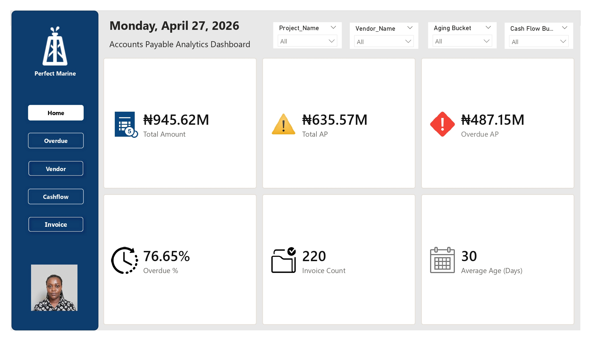
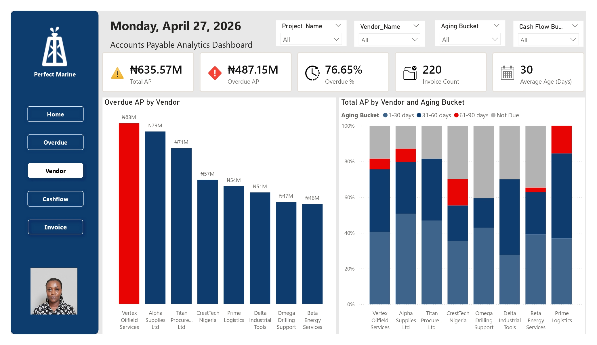
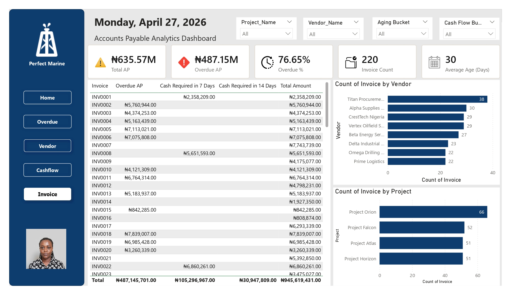
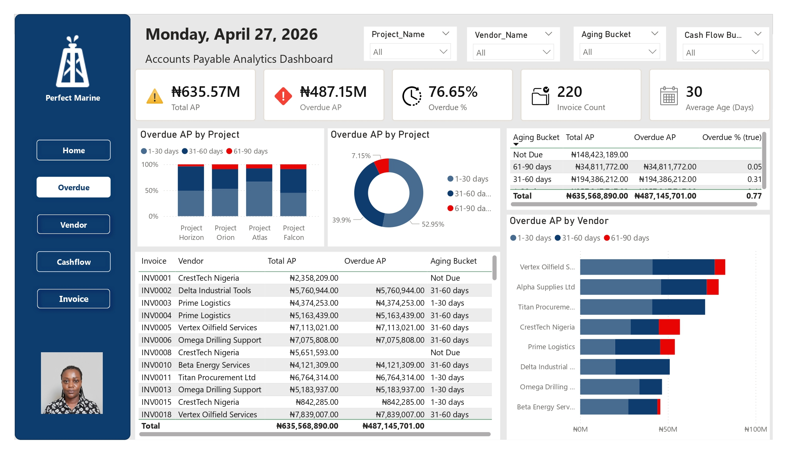
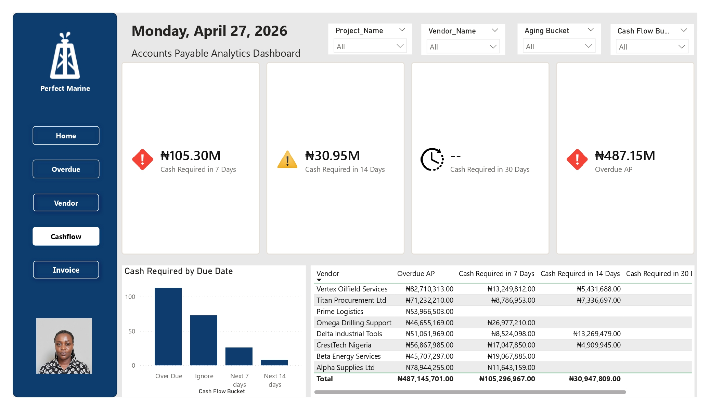

# Accounts Payable Aging Analysis for Perfect Marine Limited

Accounts Payable Aging Analysis dashboard built in Power BI using Power Query and DAX to track overdue invoices, vendor exposure, aging buckets, and short-term cash flow requirements.

---
## Table of Contents

- [Executive Summary](#executive-summary)  
- [Introduction](#introduction)  
- [Business Problem](#business-problem)  
- [Objectives](#objectives)  
- [Business Impact](#business-impact)  
- [Dataset Description](#dataset-description)  
- [Tools & Technologies](#tools--technologies)  
- [Methodology](#methodology)  
- [Data Cleaning & Transformation](#data-cleaning--transformation)  
- [Assumptions Made During Analysis](#assumptions-made-during-analysis)  
- [Key Performance Indicators (KPIs)](#key-performance-indicators-kpis)  
- [Exploratory Data Analysis](#exploratory-data-analysis)  
- [Findings & Insights](#findings--insights)  
- [Dashboard Overview](#dashboard-overview)  
- [Recommendations](#recommendations)  
- [Limitations](#limitations)  
- [Future Improvements](#future-improvements)  
- [Skills Demonstrated](#skills-demonstrated)  
- [Conclusion](#conclusion)

---

## Executive Summary
This project presents an Accounts Payable (AP) Aging Analysis conducted for Perfect Marine using Power BI, Power Query, and Excel.

The analysis was performed to evaluate overdue liabilities, monitor vendor exposure, assess project-level financial risks, and forecast short-term cash flow requirements.

The findings revealed that total Accounts Payable stood at ₦635.57M, of which ₦487.15M was overdue, representing 76.65% of total AP. The analysis also identified immediate liquidity pressure, with ₦105.30M required within the next 7 days to meet urgent payment obligations.

Interactive dashboards were developed to provide management with a centralized reporting system for monitoring aging trends, overdue invoices, vendor exposure, and cash flow requirements.

---

# Introduction
Accounts Payable Aging Analysis is an important financial management process used to monitor unpaid invoices, evaluate overdue liabilities, and improve cash flow planning.

For Perfect Marine, this analysis provided visibility into outstanding invoices across vendors and projects while supporting proactive financial decision-making.

The project demonstrates how Power BI can transform raw financial data into actionable business insights through data cleaning, transformation, visualization, and reporting.

---

# Business Problem
Prior to this analysis, Perfect Marine lacked a structured system for tracking overdue invoices and payment obligations.

This resulted in:
- Limited visibility into overdue liabilities
- Difficulty prioritizing vendor payments
- Reactive cash flow management
- Increased operational and financial risk
- Potential strain on vendor relationships

The company required a centralized reporting solution to monitor Accounts Payable performance and support better financial planning.

---

# Objectives
The objectives of this project were to:

- Analyze total Accounts Payable balances
- Determine overdue liabilities and overdue percentages
- Categorize invoices into aging buckets
- Identify vendor and project-level exposure
- Forecast short-term cash flow requirements
- Develop interactive dashboards for financial monitoring
- Support proactive financial decision-making

---

# Business Impact
This analysis provides management with actionable financial insights that support:
- Improved supplier relationship management
- Better cash allocation decisions
- Reduced operational disruption risks
- Enhanced financial visibility
- Faster identification of overdue liabilities
- Proactive rather than reactive cash flow planning

The dashboard also establishes a repeatable reporting framework for ongoing financial monitoring.

---

# Dataset Description
The dataset used for this analysis contained 220 invoice records and included the following fields:

- Invoice Reference
- Vendor Name
- Project Name
- Invoice Date
- Invoice Amount
- Payment Status

Additional calculated columns were created during data transformation to support aging analysis and cash flow forecasting.

---

# Tools & Technologies

| Tool | Purpose |
|---|---|
| Power BI | Dashboard development and data visualization |
| Power Query (M Code) | Data cleaning and transformation |
| Microsoft Excel | Data source storage |

---

# Methodology

## 1. Data Extraction
The Excel dataset was imported into Power BI for analysis.

## 2. Data Transformation
Power Query was used to:
- Create Due Dates
- Calculate Aging Days
- Create Due Status logic
- Build Aging Buckets
- Generate Cash Flow Buckets

## 3. Data Modeling
Cleaned and transformed tables were structured for reporting and KPI calculations.

## 4. Dashboard Development
Interactive dashboards were created to visualize:
- Total Accounts Payable
- Overdue balances
- Vendor exposure
- Project exposure
- Aging trends
- Cash flow requirements

---

# Data Cleaning & Transformation

## Data Cleaning Steps
The following cleaning activities were performed:
- Promoted headers
- Corrected data types
- Removed redundant columns
- Standardized date formats
- Standardized currency formats
- Validated missing and inconsistent values

## Custom Columns Created

### Due Date
Calculated as:
```text
Invoice Date + 30 Days
```

### Aging Days
Calculated using the difference between the reporting date and due date.

### Due Status
Invoices were classified as:
- Not Due
- Over Due

### Aging Buckets
Invoices were grouped into:
- Not Due
- 1–30 Days
- 31–60 Days
- 61–90 Days
- Above 90 Days

### Cash Flow Buckets
Invoices were categorized into:
- Over Due
- Next 7 Days
- Next 14 Days
- Next 30 Days
- Next 60 Days
- Next 60+ Days

### Sorting Logic
Additional sorting columns were created to ensure proper chronological display within Power BI visuals.

---

# Assumptions Made During Analysis
The following assumptions were applied during the analysis:

- A standard 30-day payment term was used
- Only unpaid invoices were included in overdue calculations
- The reporting date used was April 27, 2026
- Source data provided was assumed to be accurate and complete
- Currency values were assumed to remain stable during the analysis period

---

# Key Performance Indicators (KPIs)

| KPI | Value |
|---|---|
| Total Accounts Payable | ₦635.57M |
| Overdue Accounts Payable | ₦487.15M |
| Overdue Percentage | 76.65% |
| Total Invoice Count | 220 |
| Average Invoice Age | 30 Days |
| Cash Required in Next 7 Days | ₦105.30M |
| Cash Required in Next 14 Days | ₦30.95M |

---

# Exploratory Data Analysis

## Invoice Distribution
- Total invoices analyzed: 220
- Project Orion recorded the highest invoice volume
- Vendor liabilities were concentrated among a few suppliers

## Aging Trend Analysis
The 31–60 Days aging bucket accounted for the largest share of overdue liabilities, indicating persistent payment delays beyond the standard payment cycle.

## Cash Flow Analysis
The organization requires over ₦136M within the next 14 days to meet short-term payment obligations.

---

# Findings & Insights

#### High Overdue Exposure - 76.65% of total Accounts Payable was overdue, indicating significant delays in payment processing.

#### Vendor Concentration Ris: The highest overdue balances were linked to:
- Vertex Oilfield Services – ₦82.71M
- Alpha Supplies Ltd – ₦78.94M
- Titan Procurement Ltd – ₦71.23M
This creates operational and supplier dependency risks.

#### Immediate Liquidity Pressure - ₦105.30M is required within the next 7 days to meet urgent payment obligations.

#### Project-Level Exposure - Projects Orion, Falcon, Atlas, and Horizon all recorded overdue balances.

#### Operational Risk - Continued payment delays may result in:
- Vendor distrust
- Delayed procurement
- Service interruptions
- Reduced operational efficiency

---

# Dashboard Overview

The Power BI dashboard was designed to provide management with a centralized reporting solution through the following views:

## Executive Summary Dashboard



- Total AP
- Overdue AP
- Overdue %
- Invoice Counts
- Average Invoice Age

## Vendor Analysis Dashboard



- Vendor exposure
- Overdue balances by vendor
- Vendor concentration analysis

## Project Analysis Dashboard



- Project-level liabilities
- Invoice distributions by project
- Provides invoice-level details for operational review and reconciliation.

## Aging Analysis Dashboard



- Aging bucket distribution
- Overdue trends
- Invoice aging patterns

## Cash Flow Forecast Dashboard



- Upcoming payment obligations
- Short-term cash requirements


---

# Recommendations

- Prioritize High-Risk Vendor Payments - Immediate attention should be given to vendors with the highest overdue balances to reduce operational disruption risks.

- Improve Cash Flow Planning - Management should allocate funds to cover immediate payment obligations and establish rolling cash flow forecasts.

- Strengthen Payment Monitoring - A structured AP monitoring process should be implemented to track due dates proactively.

- Review Payment Processes - The company should evaluate approval workflows and payment cycles to identify operational bottlenecks.

- Negotiate Vendor Payment Terms - Management should negotiate revised payment arrangements with high-exposure vendors where necessary.

- Automate Reporting - The dashboard should be integrated into regular financial reporting for continuous monitoring.

- Conduct Periodic Aging Reviews - Monthly AP aging reviews should be conducted to identify risks early.

---

# Limitations

The analysis has the following limitations:

- The report represents a static snapshot as of April 27, 2026
- Actual vendor payment terms may vary
- Currency fluctuations were not considered
- Results depend on source data accuracy and completeness

---

# Future Improvements

Potential future enhancements include:

- ERP system integration
- Automated dashboard refresh scheduling
- Predictive cash flow forecasting
- Supplier risk scoring
- Dynamic payment term analysis

---

# Skills Demonstrated

This project demonstrates the following skills:

- Data Cleaning
- Data Transformation
- Power Query (M Code)
- Financial Analysis
- Dashboard Design
- KPI Development
- Business Intelligence Reporting
- Data Storytelling
- Cash Flow Analysis

---

# Conclusion
This project demonstrates how Power BI can be used to transform raw financial data into actionable business insights.

The analysis identified significant overdue liabilities, vendor concentration risks, and short-term cash flow pressure while providing management
with a centralized reporting solution for monitoring Accounts Payable performance.

The dashboards support proactive financial planning, improved vendor management, and more informed decision-making.
````
